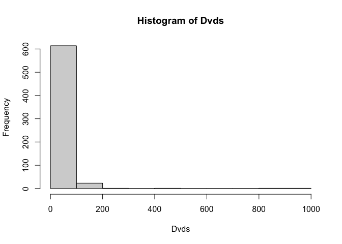
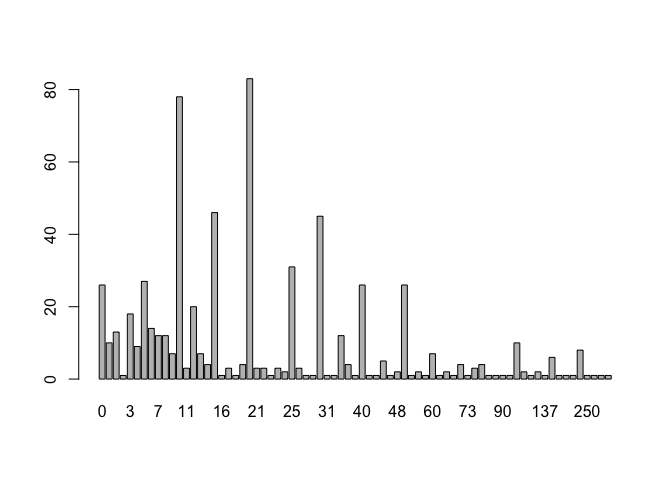

STAT690ABSHW1
================
YuWang
2024-02-08

## 2 Programming

### (a)

``` r
data(studentdata)
Dvds <- studentdata$Dvds
hist(Dvds)
```



### (b)

``` r
summary(Dvds)
```

    ##    Min. 1st Qu.  Median    Mean 3rd Qu.    Max.    NA's 
    ##    0.00   10.00   20.00   30.93   30.00 1000.00      16

### (c)

``` r
#table(Dvds)
barplot(table(Dvds))
```



We could see that when the numbers of Dvds is equal to 10,15,20,etc, It
would have higher values. Therefore may be 5 dvds was regards as a set
and student will be willing to have a set instead of buying one by one.
